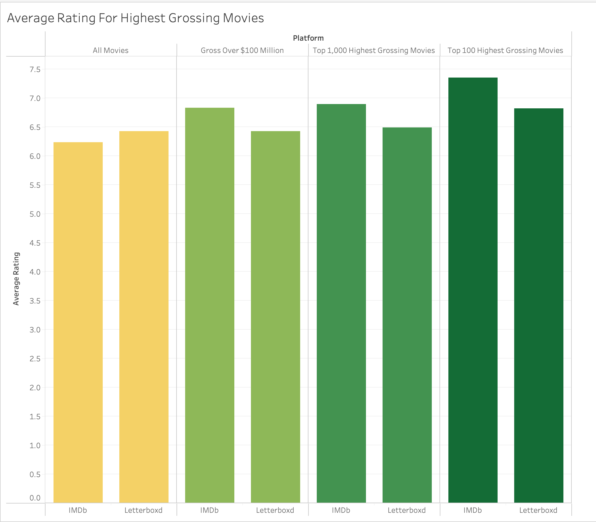

# IMDb vs. Letterboxd: Comparative Analysis of Film Ratings

## Overview
This data analysis project examines the differences in film ratings between two major film review platforms: IMDb and Letterboxd. IMDb was founded in 1990 while Letterboxd was founded in 2011, and has seen a surge in its popularity since 2020. This suggests that the IMDb audience would be more broad and mainstream, and Letterboxd would attract a younger user base.

The goal of this project was to compare the two platforms by analyzing rating patterns using various film attributes (release year, genre, language, and box office performance).

## Technical Details
- **Analysis Tools:** PostgreSQL (for data storage, cleaning, and analysis)
- **Visualization:** Tableau (for creating visualizations and dashboards)

The Tableau dashboard for this project can be found [here](https://public.tableau.com/app/profile/brandonancil/viz/IMDbvs_Letterboxd/Dashboard1).

## Questions
1. **Yearly Trends:** How do average ratings compare between IMDb and Letterboxd by release year?
2. **Box Office Success:** Do the highest grossing films receive different ratings across platforms?
3. **Genre Comparison:** Which genres show the largest rating disparities between platforms?
4. **Language Analysis:** Do foreign-language films show differing rating patterns compared to English-language films?

## Data Sources
- [**The Ultimate 1Million Movies Dataset (TMDB + IMDb)**](https://www.kaggle.com/datasets/alanvourch/tmdb-movies-daily-updates)**:** A dataset from Kaggle that features films curated from The Movie Database (TMDB) along with their corresponding IMDb ratings. This dataset is updated daily.
- [**Letterboxd (Movies Dataset)**](https://www.kaggle.com/datasets/gsimonx37/letterboxd)**:** A dataset from Kaggle that pulls data from Letterboxd. The dataset was last updated in June 2024.

## Analysis

### Data Cleaning & Matching Process
- **Data Cleaning:**
  - Removed duplicates and standardized data formats.
  - Used SQL for data cleaning and uploading datasets to a relational database.
  - Removed films not present in both datasets or with less than 100 ratings on IMDb.
  - Restructured table schemas optimize for analysis.

- **Data Matching:**
  - Performed fuzzy matching based on combinations of metadata to pair films across datasets.
      - For example, matching films with the same name, release year, and runtime.
  - Applied regular expressions to strip non-alphanumeric characters from movie titles to improve matches.
  - Used proximity matching for films with slight variations in runtime (±3 minutes) or release year (±1 year).
  - Successfully matched over **70,000 films** across both datasets for analysis.

🖥️ Query: [0_data_cleaning.sql](0_data_cleaning.sql)

---

### Year-Based Ratings Analysis
- Compared IMDb and Letterboxd ratings by **decade** and **individual year**.
- Displayed the average rating per year as a line graph.

🖥️ Query: [1_average_rating_by_year.sql](1_average_rating_by_year.sql)

**📈 Visualization:**

📊 **Key Findings:**
- **Letterboxd ratings consistently higher** than IMDb ratings across most years.
- The rating discrepancy between Letterboxd and IMDb widens for films released between the 1950s and the 1990s and shrinks afterward.

---

### Box Office Success & Ratings Analysis
- Filtered films that grossed over **$100 million** (~1,300 films).
- Created a bar chart that analyzed average ratings based on:
  1. All movies overall
  2. Movies grossing over $100M
  3. Top 1,000 highest grossing films
  4. Top 100 highest grossing films
- Created another visualization that specifically looked at rating differences for each film that grossed over **$1 billion** (27 films).

🖥️ Query: [2_average_rating_by_gross.sql](2_average_rating_by_gross.sql)

**📈 Visualizations:**

📊 **Key Findings:**
- **Higher grossing films showed increasing average ratings.**
- **IMDb ratings surpassed Letterboxd ratings** when focusing on the highest grossing films.
- Diving into the **$1B+ grossing films** revealed that IMDb had higher or equal ratings for every film except for **Barbie (2023)**, which Letterboxd rated higher.

---

### Genre-Based Ratings Analysis
- Compared ratings by film genre in a scatter plot:
  - Most common: **Drama (34,000 films)**, **Comedy (25,000 films)**.
  - Other popular genres: Action, Romance, Horror, Thriller (~10,000-12,000 entries each).

🖥️ Query: [3_average_rating_by_genre.sql](3_average_rating_by_genre.sql)

**📈 Visualization:**

📊 **Key Findings:**
- **Letterboxd ratings slightly higher across nearly every genre.**
- Letterboxd ratings were especially higher than IMDb for **Horror and Science Fiction** movies.
- **History, TV Movies, and Documentaries** were the only genres where IMDb had marginally higher ratings.

---

### Language-Based Ratings Analysis
- Classified films based on **language spoken**, rather than production country.
- Created two visualizations:
  1. **Scatter plot:** Direct comparison of IMDb vs. Letterboxd ratings per language.
  2. **Average ratings:** English-speaking films vs. foreign-language films.

🖥️ Query: [4_average_rating_by_language.sql](4_average_rating_by_language.sql)

**📈 Visualizations:**

📊 **Key Findings:**
- **Letterboxd ratings higher across more languages.**
- Specifically, Letterboxd had higher ratings across the most popular languages (English, Spanish, French, etc).
- **Foreign-language films rated higher** than English-speaking films overall.
- Letterboxd maintained higher averages across both English-speaking and Foreign-language categories.
